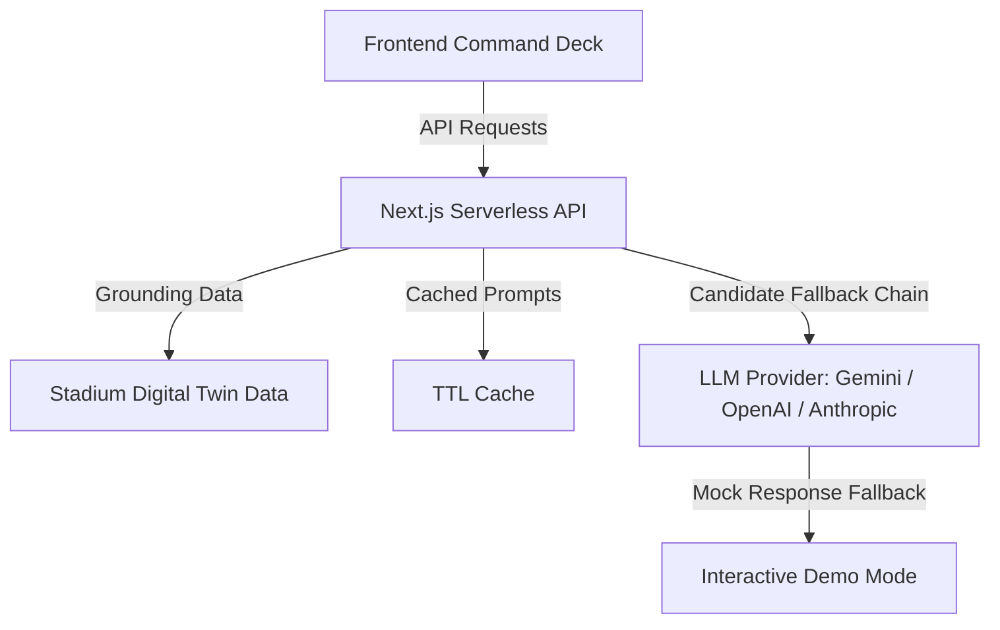

# StadiumOps Pro — AI-Powered Stadium Command Center

> **PromptWars Challenge 04 · Smart Stadiums & Tournament Operations**  
> **Chosen Vertical**: 🏟️ Venue Staff (Operations Commander)  
> **Core Focus**: Crowd Management & Real-Time Operational Intelligence  
> **GitHub Repository**: [github.com/shlok772006/StadiumOps](https://github.com/shlok772006/StadiumOps)

---

## 1. Executive Summary

StadiumOps Pro is an AI-native stadium operations command center designed for venue staff (e.g., Stadium Operations Commanders) coordinating security, transit, and crowd safety at **MetLife Stadium** during the **FIFA World Cup 2026**. 

Unlike simple FAQ assistants, StadiumOps Pro features an **AI Reasoning Engine** at its core. It does not just report metrics—it continuously monitors stadium digital twin data, reasons about observations, forecasts bottlenecks, and designs actionable, step-by-step operational recommendations with quantified benefits.

---

## 2. Chosen Vertical & Persona Focus

To deliver maximum depth and practical usability, this platform is built exclusively around **one primary persona**:
* **🏟️ Venue Staff (Operations Commander)**: Safety leads coordinating crowd flow, security stewards, vendor stocks, transit, and medical responses across an 82,500-seat stadium.

### Core Problems Solved Deeply:
1. **Crowd Congestion & Risk Support**: Predicts queues 15–60 minutes ahead, dynamically calculating when a gate will hit a critical threshold and proposing rerouting actions.
2. **Emergency Command (SOS)**: Ingests medical, fire, or security incidents and generates immediate step-by-step action plans showing nearest local resources (e.g., First Aid Posts, low-density exits).

---

## 3. Architecture & Core AI Logic

The application is built using **Next.js 14** (Pages Router) and **Vanilla CSS** with a streamlined server-side execution model.



### The "One Brain" System Prompt
All AI requests are grounded in the venue's live state (`lib/stadiumData.js`). The orchestrator (`lib/orchestrator.js`) builds grounded prompt templates containing:
- Live gate densities, flow rates, and wait times.
- Real-time seating sections and nearest gate mappings.
- Current coordinates of medical posts, restrooms, and concessions.
- Transit arrival schedules and capacity load factors.
- Live weather conditions.

### AI Reasoning Constraints
The LLM is strictly constrained to use **Logical Chain-of-Thought (CoT)** reasoning. Every recommendation must feature:
1. **Observation**: State the raw data (e.g., *"Gate B at 92% load"*).
2. **Reasoning**: Explain why it matters (e.g., *"Wait time will exceed safety limits within 4 minutes"*).
3. **Actionable Plan**: Provide a concrete recommendation (e.g., *"Redirect arriving fans to Gate C"*).
4. **Quantified Benefit**: Estimate the positive impact (e.g., *"Reduces average wait by 11 minutes"*).

---

## 4. Key Differentiators & Features

- **🧠 Interactive AI Reasoning Panels**: Metric blocks across the app feature a "Reveal AI Reasoning" button, explaining the logic behind warnings.
- **🗺️ Interactive Digital Twin Map**: A custom SVG map reflecting live gate states with pulse animations, overlayed with facility pins for medical posts, food courts, and washrooms.
- **📈 Interactive Telemetry Charts**: Built on Chart.js, rendering live gate utilization curves, vendor performance, transit load, and 60-minute prediction lines.
- **📁 Custom CSV/JSON Data Upload**: Ingest custom datasets. The AI reads headers, scans records, and provides instant operations analysis.
- **🚨 Emergency SOS Module**: Formulates rapid checklists during incidents and displays nearest medical facilities.
- **📋 PDF Report Exports**: Generates daily ops, match-day, and crowd reports via AI and downloads them as styled PDFs using `jsPDF`.
- **🌐 6-Language Native Translation**: Generates briefings natively in English, Hindi, Spanish, French, Arabic, or Portuguese.

---

## 5. How It Works: Step-by-Step

1. **Dashboard (`/dashboard`)**: The main command deck displaying total attendance, average wait times, active incident tickers, and a live AI Operational Briefing.
2. **AI Assistant (`/ai-assistant`)**: Natural language chat grounded in stadium metrics. Supports voice input (Web Speech API) and read-aloud voice feedback.
3. **Crowd Analytics (`/crowd`)**: Live density lists, 60-minute predicted curves, and predictive gate recommendations.
4. **Emergency Console (`/emergency`)**: Quick SOS button, incident reporting form, and active incident tracker.
5. **Analytics (`/analytics`)**: Detailed bar, line, and pie charts showing transit capacities, concessions sales, and weather parameters.
6. **Data Upload (`/upload`)**: Drag-and-drop parser for external CSV or JSON operational logs.
7. **AI Reports (`/reports`)**: Formats and packages summary briefings into downloadable PDF reports.
8. **Settings (`/settings`)**: Adjust dark/light modes, text size, and contrast.

---

## 6. Evaluation Criteria Compliance

### Code Quality (High Impact)
Written in modular, readable JavaScript (ES6+). Strictly separates data models (`lib/stadiumData.js`), AI prompt orchestration (`lib/orchestrator.js`), and frontend views (`pages/`). Includes full Jest test suites.

### Security (High Impact)
All API secrets are stored server-side in `.env.local`. Git is configured to block credential leaks by ignoring `.env` and `.env.local` files automatically.

### Efficiency (Medium Impact)
Incorporates a **TTL Cache** (`lib/cache.js`) for insights and crowd predictions, limiting network latency and API credit consumption during peak use.

### Validation & Testing (Medium Impact)
Equipped with 30 automated Jest tests checking data model integrity, prompt formatting rules, caching TTL bounds, and API utilities.
Run tests using: `npm test`

### Accessibility (Low Impact)
Designed with high-contrast accessibility tags, keyboard navigability support, readable fonts, customizable scales, and text-to-speech support for visually impaired operators.

---

## 7. Configuration & Setup

### Environment Variables
Create a `.env.local` file in the root directory:
```env
LLM_PROVIDER=gemini
GEMINI_API_KEY=your_gemini_api_key_here
```

### Mock Fallback (Zero-Config Demo Mode)
If no Gemini API key is configured, the application **automatically activates Demo Mode**, serving realistic mock AI responses. You can test all features without an external Google AI Studio key!

### Run Locally
```bash
# Install dependencies
npm install

# Run Jest tests
npm test

# Build production bundle
npm run build

# Start local server
npm run dev
```
Open **[http://localhost:3000](http://localhost:3000)** in your browser.